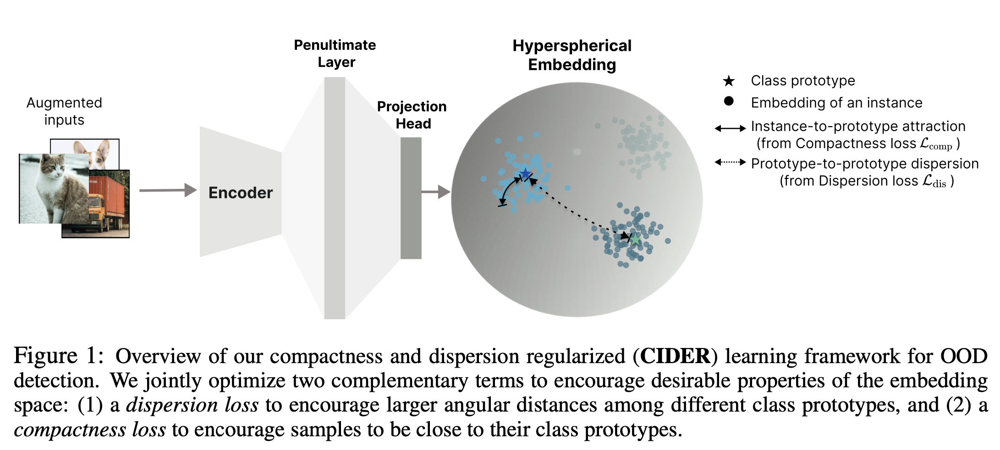

# How to Exploit Hyperspherical Embeddings for Out-of-Distribution Detection? 

This codebase provides a Pytorch implementation for the paper CIDER: [How to Exploit Hyperspherical Embeddings for Out-of-Distribution Detection?](https://openreview.net/forum?id=aEFaE0W5pAd) at ICLR 2023.

### Abstract

Out-of-distribution (OOD) detection is a critical task for reliable machine learning. Recent advances in representation learning give rise to distance-based OOD detection, where testing samples are detected as OOD if they are relatively far away from the centroids or prototypes of in-distribution (ID) classes. However, prior methods directly take off-the-shelf contrastive losses that suffice for classifying ID samples, but are not optimally designed when test inputs contain OOD samples. In this work, we propose CIDER, a novel representation learning framework that exploits hyperspherical embeddings for OOD detection. CIDER jointly optimizes two losses to promote strong ID-OOD separability: a dispersion loss that promotes large angular distances among different class prototypes, and a compactness loss that encourages samples to be close to their class prototypes. We analyze and establish the unexplored relationship between OOD detection performance and the embedding properties in the hyperspherical space, and demonstrate the importance of dispersion and compactness. CIDER establishes superior performance, outperforming the latest rival by 19.36% in FPR95. 

### Illustration




## Quick Start

Remarks: We are actively working on improving the codebase for reproducibility and ease of use. Stay tuned for more updates :).

### Update logs
**Aug 12**: In alignment with prior works on the [ImageNet-100](https://github.com/deeplearning-wisc/MCM/tree/main) subset (the script for generating the subset is provided [here](https://github.com/deeplearning-wisc/MCM/blob/main/create_imagenet_subset.py)), we've also finetuned CIDER with the default hyperparameters (e.g., 10 epochs with ResNet-34) and report the performance below for reference. The results are averaged over 3 seeds:

| OOD         | FPR95          | AUROC          | AUPR           |
|-------------|----------------|----------------|----------------|
| SUN         | 32.84 ± 1.86   | 92.24 ± 0.38   | 91.72 ± 0.28   |
| Places365   | 45.31 ± 1.74   | 90.10 ± 0.48   | 90.90 ± 0.42   |
| Textures         | 10.03 ± 0.23   | 98.21 ± 0.02   | 98.37 ± 0.02   |
| iNaturalist | 15.42 ± 2.38   | 97.28 ± 0.31   | 97.80 ± 0.22   |
| AVG         | 25.90 ± 1.47   | 94.46 ± 0.29   | 94.70 ± 0.22   |


The checkpoint is available [here](https://drive.google.com/drive/folders/1IJXpHLllI9pj39xn25LSNRaVHZ9fFz6-?usp=sharing). 

**Apr 28**: Updated prototype initialization with ID training set (Thanks [zjysteven](https://github.com/zjysteven)); changed default weight scale from 2.0 to 1.0 in train_cider_cifar100.sh for better performance. 

### Data Preparation

The default root directory for ID and OOD datasets is `datasets/`. We consider the following (in-distribution) datasets: CIFAR-10, CIFAR-100, and ImageNet-100. 

**Small-scale OOD datasets** For small-scale ID (e.g. CIFAR-10), we use SVHN, Textures (dtd), Places365, LSUN-C (LSUN), LSUN-R (LSUN_resize), and iSUN. 

OOD datasets can be downloaded via the following links (source: [ATOM](https://github.com/jfc43/informative-outlier-mining/blob/master/README.md)):

* [SVHN](http://ufldl.stanford.edu/housenumbers/test_32x32.mat): download it and place it in the folder of `datasets/small_OOD_dataset/svhn`. Then run `python utils/select_svhn_data.py` to generate test subset.
* [Textures](https://www.robots.ox.ac.uk/~vgg/data/dtd/download/dtd-r1.0.1.tar.gz): download it and place it in the folder of `datasets/small_OOD_dataset/dtd`.
* [Places365](http://data.csail.mit.edu/places/places365/test_256.tar): download it and place it in the folder of `datasets/ood_datasets/places365/test_subset`. We randomly sample 10,000 images from the original test dataset. 
* [LSUN](https://www.dropbox.com/s/fhtsw1m3qxlwj6h/LSUN.tar.gz): download it and place it in the folder of `datasets/small_OOD_dataset/LSUN`.
* [LSUN-resize](https://www.dropbox.com/s/moqh2wh8696c3yl/LSUN_resize.tar.gz): download it and place it in the folder of `datasets/small_OOD_dataset/LSUN_resize`.
* [iSUN](https://www.dropbox.com/s/ssz7qxfqae0cca5/iSUN.tar.gz): download it and place it in the folder of `datasets/small_OOD_dataset/iSUN`.

For example, run the following commands in the **root** directory to download **LSUN-C**:
```
cd datasets/small_OOD_dataset
wget https://www.dropbox.com/s/fhtsw1m3qxlwj6h/LSUN.tar.gz
tar -xvzf LSUN.tar.gz
```

The directory structure looks like this:

```python
datasets/
---CIFAR10/
---CIFAR100/
---small_OOD_dataset/
------dtd/
------iSUN/
------LSUN/
------LSUN_resize/
------places365/
------SVHN/
```


**Large-scale OOD datasets** For large-scale ID (e.g. ImageNet-100), we use the curated 4 OOD datasets from [iNaturalist](https://arxiv.org/pdf/1707.06642.pdf), [SUN](https://vision.princeton.edu/projects/2010/SUN/paper.pdf), [Places](http://places2.csail.mit.edu/PAMI_places.pdf), and [Textures](https://arxiv.org/pdf/1311.3618.pdf), and de-duplicated concepts overlapped with ImageNet-1k. The datasets are created by  [Huang et al., 2021](https://github.com/deeplearning-wisc/large_scale_ood) .

The subsampled iNaturalist, SUN, and Places can be downloaded via the following links:

```
wget http://pages.cs.wisc.edu/~huangrui/imagenet_ood_dataset/iNaturalist.tar.gz
wget http://pages.cs.wisc.edu/~huangrui/imagenet_ood_dataset/SUN.tar.gz
wget http://pages.cs.wisc.edu/~huangrui/imagenet_ood_dataset/Places.tar.gz

```
The directory structure looks like this:
```python
datasets/
---ImageNet100/
---ImageNet_OOD_dataset/
------dtd/
------iNaturalist/
------Places/
------SUN/
```


## Training and Evaluation 

### Model Checkpoints

**Evaluate pre-trained checkpoints** 

Our checkpoints can be downloaded here for [CIFAR-100](https://drive.google.com/drive/folders/1SjW2kvhDQ6qcsIo5TR7eLMrcL3r6Y3QN?usp=share_link) and [CIFAR-10](https://drive.google.com/drive/folders/1rkXQYHcaITZCj55OLNXqy_b-yjktONrn?usp=share_link). Create a directory named `checkpoints/[ID_DATASET]` in the root directory of the project and put the downloaded checkpoints here. For example, for CIFAR-10 and CIFAR-100:

```
checkpoints/
---CIFAR-10/	 	
------ckpt_c10/
------checkpoint_500.pth.tar
---CIFAR-100/	 	
------ckpt_c100/
------checkpoint_500.pth.tar
```

The following scripts can be used to evaluate the OOD detection performance:

```
sh scripts/eval_ckpt_cifar10.sh ckpt_c10 #for CIFAR-10
sh scripts/eval_ckpt_cifar100.sh ckpt_c100 # for CIFAR-100
```


**Evaluate custom checkpoints** 

If the default directory to save checkpoints is not `checkpoints`, create a softlink to the directory where the actual checkpoints are saved and name it as `checkpoints`. For example, checkpoints for CIFAR-100 (ID) are structured as follows: 

```python
checkpoints/
---CIFAR-100/
------name_of_ckpt/
---------checkpoint_500.pth.tar
```


**Train from scratch** 

We provide sample scripts to train from scratch. Feel free to modify the hyperparameters and training configurations.

```
sh scripts/train_cider_cifar10.sh
sh scripts/train_cider_cifar100.sh
```

**Fine-tune from ImageNet pre-trained models** 

We also provide fine-tuning scripts on large-scale datasets such as ImageNet-100.

```
sh scripts/train_cider_imgnet100.sh  # To be updated
```


### Citation

If you find our work useful, please consider citing our paper:

```
@inproceedings{ming2023cider,
 title={How to Exploit Hyperspherical Embeddings for Out-of-Distribution Detection?},
 author={Yifei Ming and Yiyou Sun and Ousmane Dia and Yixuan Li},
 booktitle={The Eleventh International Conference on Learning Representations },
  year={2023},
  url={https://openreview.net/forum?id=aEFaE0W5pAd}
}
```

### Further discussions
For more in-depth discussions on the method and extensions, feel free to drop an email at ming5@wisc.edu :)

